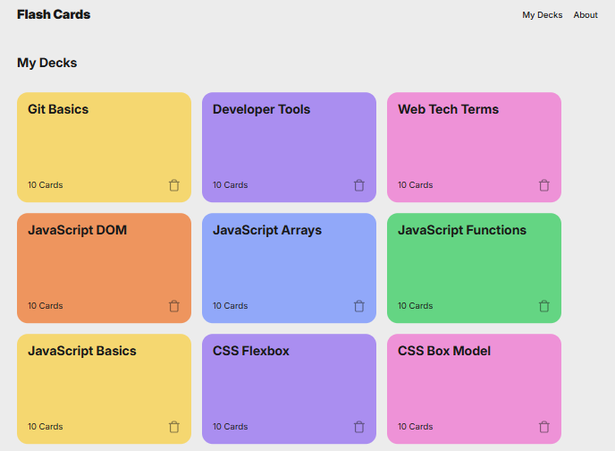
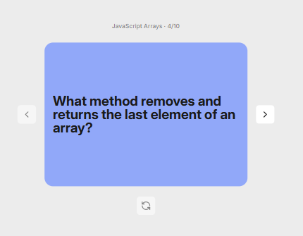

#Flashcard App

##My first project in TripleTen’s AI-Assisted Software Engineering program. The project includes a title, reference clickable links, and 12 software engineering relatable categories. Once selected, each category contains a total of 10 questions that can be viewed in a carousel. The carousel has an interactive flip button to view the answer of each question.

##This project features a simple, easy to navigate display with clear fonts and 12 selectable category decks. Each category deck is display in a different color and includes the total count for the number of questions with a functionable delete button. 

Page displays a non-functionable new deck option. Once selected, each category displays a carousel with a left click functionable button, a right click functionable button, and a functionable flip button to display individual answers.

##The project implements __three main__ software technologies. 

1-	One structured __HTML__ document with the following sections
*A deck template section.
*A carousel section 
*And a not found section. 

2-	One styling page on __CSS__ format that controls the website’s appearance.

3-	Four exported and imported interconnected __JavaScript__ documents that render the interactivity and display of the flashcards website.  
